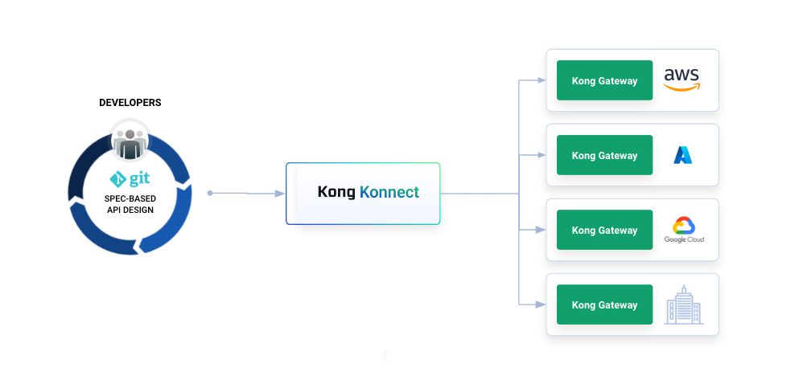
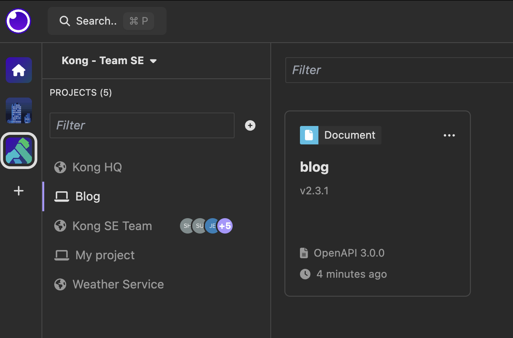
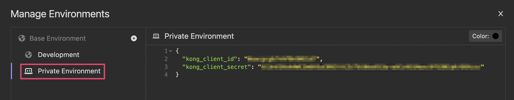
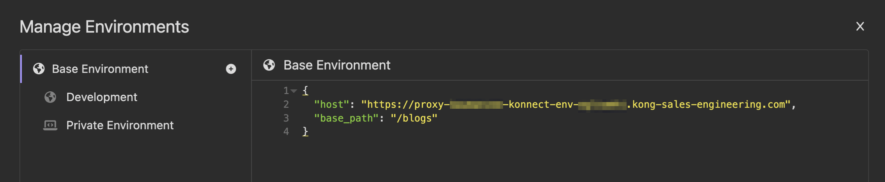
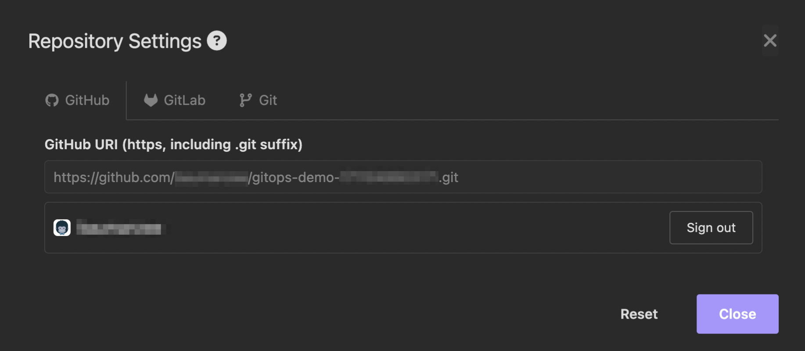

# gitops-demo

This repository provides a template for doing your own demonstration of the end to end lifecycle as depicted in the following diagram.

# Setup
## First time only
You will need to have cloned the Insomnia Document from https://github.com/Kong/se-demo-framework-requests.git into a local project:

To show the federated governance policy being applied you will have to use client credentials to successfully make calls to your newly created servcie.  Modify the environment variables by pressing \'&#8984;-E\' to get to the environment variables screen. Follow the screenshot below to:
  1. Create a new Private Environment with a copy of the values from the Development Environment.
  2. Enter the shared client credentials from "SE Demo - Client Credentials Flow" in the SE section of 1Password or the `kong_client_id` and `kong_client_secret` variables.

## Each time you create an environment
1. Update the `host` in the "Base Environment" to match your demo environment Proxy URL. 

2. In the **Blog** Insomnia Design Document, click "Setup Git Sync" to configure with the URL to this git repo and your credentials:

